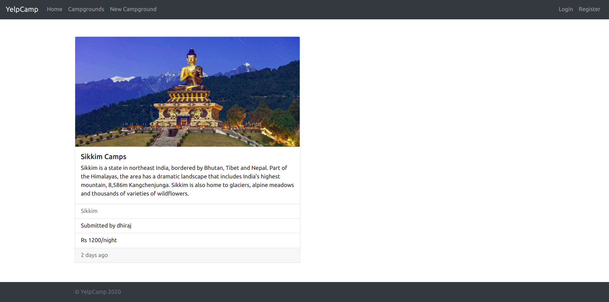
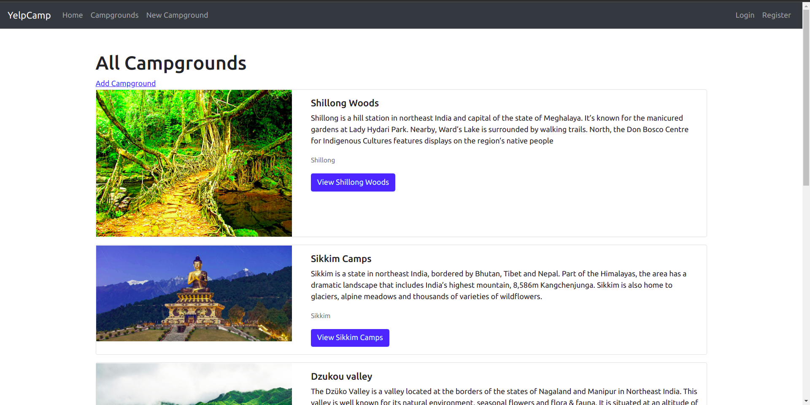
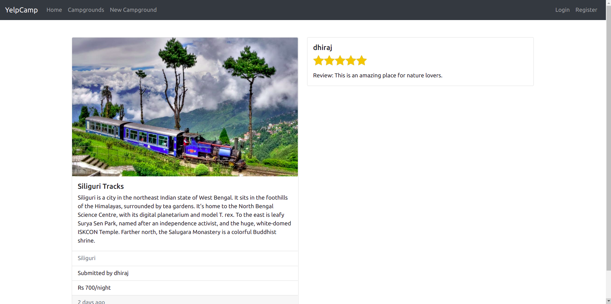

# YelpCamp

<!-- <kbd></kbd>

<kbd></kbd>

<kbd></kbd>

<kbd> </kbd>

[See more images](https://github.com/Sohan022/YelpCamp/blob/master/Demo) -->

<kbd></kbd>
<kbd></kbd>
<kbd></kbd>

```
It is a website which shows beautiful campgrounds all over the world.

This Project has created using HTML, CSS, Bootstrap, JS, NodeJS, Express and MongoDB.
```

## Features

 * Users need to login for adding new campgrounds.
 
 * User can also comment on any campground after login.
 
 * User can edit/delete own added campgrounds/comments. 
 
 * User can also see recently uploaded campground.
 
 * Flash messages are responding to users interacting with the app.
 
 * Responsive web design

 ## Run It Locally
 
 * Install [MongoDB](https://www.mongodb.com/)
 
```
    git clone https://github.com/dhirajs0/YelpCamp.git
    cd YelpCamp
    npm install
    node app.js
```
* open web browser *http://localhost:3000/*


<!-- 
[MIT LICENSE](https://github.com/dhirajs0/YelpCamp/blob/master/LICENSE.md) -->
